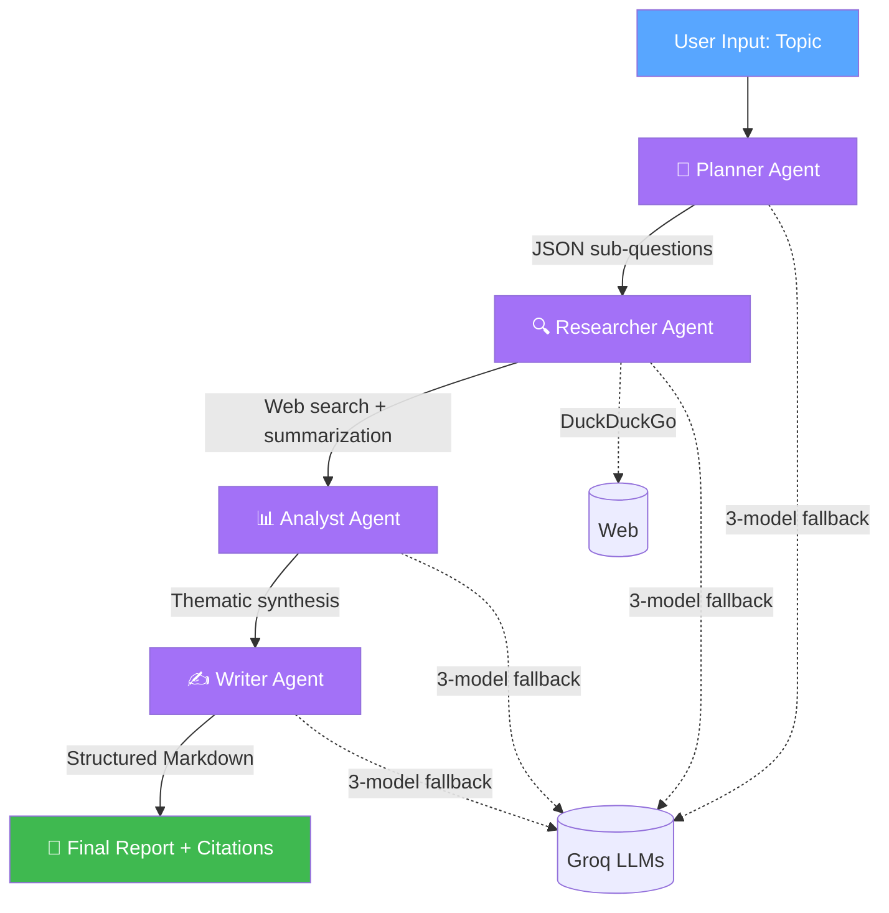
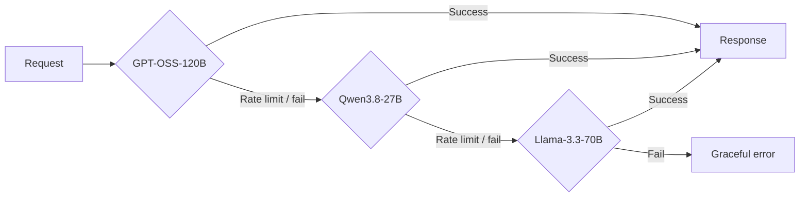
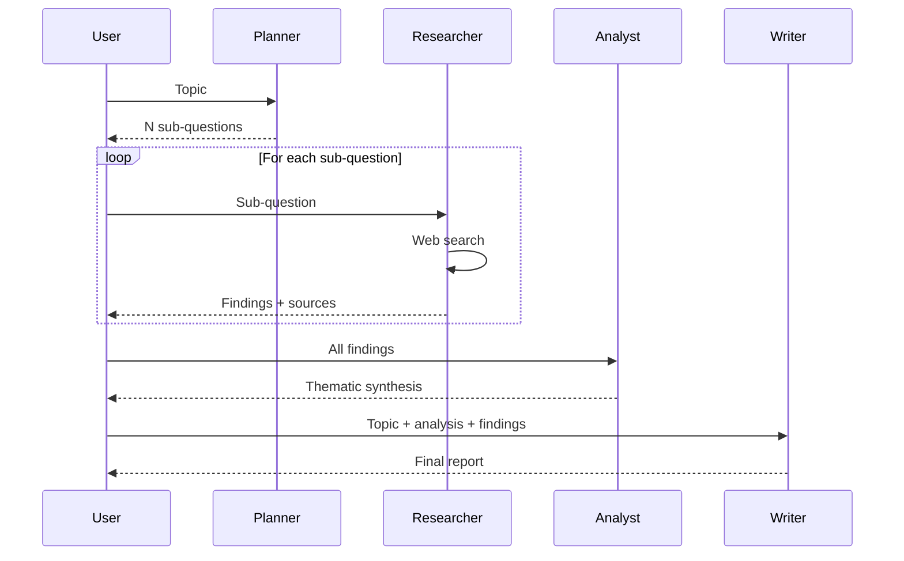

# System Architecture

## Multi-Agent Pipeline

```mermaid
flowchart TD
    A[User Input: Topic] --> B[🧠 Planner Agent]
    B -->|JSON sub-questions| C[🔍 Researcher Agent]
    C -->|Web search + summarization| D[📊 Analyst Agent]
    D -->|Thematic synthesis| E[✍️ Writer Agent]
    E -->|Structured Markdown| F[📄 Final Report + Citations]

    C -.->|DuckDuckGo| G[(Web)]
    C -.->|3-model fallback| H[(Groq LLMs)]
    B -.->|3-model fallback| H
    D -.->|3-model fallback| H
    E -.->|3-model fallback| H

    style A fill:#58a6ff,color:#fff
    style F fill:#3fb950,color:#fff
    style B fill:#a371f7,color:#fff
    style C fill:#a371f7,color:#fff
    style D fill:#a371f7,color:#fff
    style E fill:#a371f7,color:#fff
```

## Model Fallback Chain

```mermaid
flowchart LR
    A[Request] --> B{GPT-OSS-120B}
    B -->|Success| F[Response]
    B -->|Rate limit / fail| C{Qwen3.8-27B}
    C -->|Success| F
    C -->|Rate limit / fail| D{Llama-3.3-70B}
    D -->|Success| F
    D -->|Fail| E[Graceful error]
```

## Data Flow

```mermaid
sequenceDiagram
    participant U as User
    participant P as Planner
    participant R as Researcher
    participant A as Analyst
    participant W as Writer

    U->>P: Topic
    P-->>U: N sub-questions
    loop For each sub-question
        U->>R: Sub-question
        R->>R: Web search
        R-->>U: Findings + sources
    end
    U->>A: All findings
    A-->>U: Thematic synthesis
    U->>W: Topic + analysis + findings
    W-->>U: Final report
```